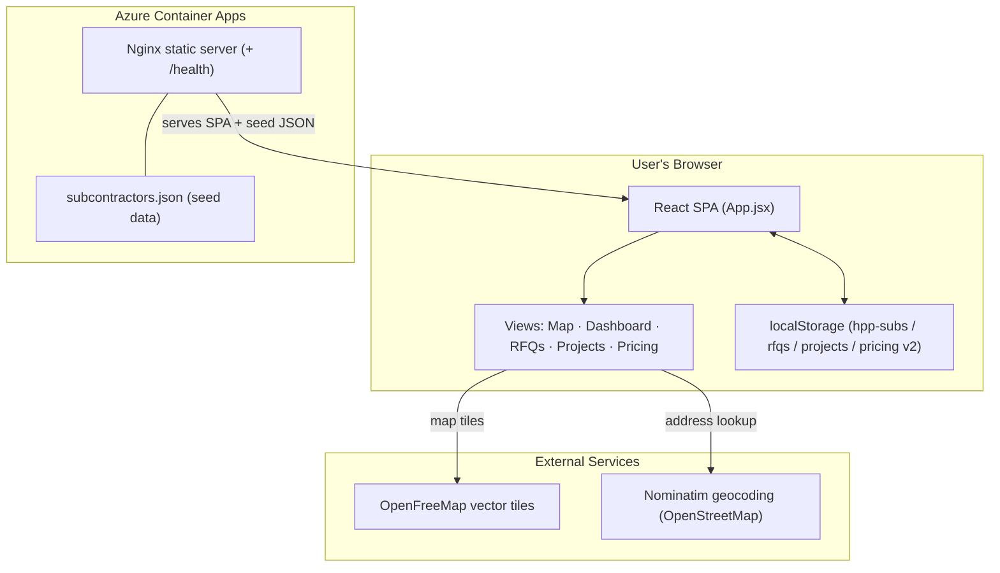

# Subcontractor Management — Application Assessment

## Read this with an AI agent

New to this app? Copy the prompt below into Claude, ChatGPT, Copilot, or Gemini. If your agent has this repository open it will read the assessment directly; otherwise paste the contents of this file after the prompt.

```text
You are helping me understand the application assessment for Subcontractor Management. If you have access to this repository, open `docs/application-assessment.md` and read it in full; otherwise read the assessment text I paste below. Then:
This is an application assessment. Give me a 5-bullet plain-language summary a non-technical stakeholder could follow, then list the top technical risks, gaps, or maintenance concerns, then offer to answer follow-up questions about how the app works.
```

## For Business Users

### What This Application Does

Subcontractor Management is Heartland Paving Partners' internal subcontractor directory and sourcing tool, described in the repository as the "Heartland Paving - Subcontractor CRM (MVP)." It gives the HPP team a single, searchable map of the subcontractors the company works with, replacing the shared spreadsheet that was previously passed between business units. The repository README notes that the application was built from the June 11 and July 8 BRD (business requirements) sessions.

The core of the application is an interactive map of the United States with a colour-coded pin for each subcontractor. Users can search and filter the directory, enter a job location and find subcontractors within a chosen distance of it, and open a detailed record for any subcontractor that captures contacts, services offered, insurance and compliance documents, a star rating, and notes. Alongside the map, the application provides a dashboard of compliance and renewal information and three record-keeping areas for requests for quote (RFQs), completed projects with performance ratings, and line-item pricing.

The seed dataset shipped with the application contains 1,710 subcontractor records. All user edits and the RFQ, project, and pricing records are stored locally in the user's own web browser rather than in a shared central database.

### Who Uses It

The intended users are the HPP team. The README dedicates the tool to "Todd, Lisa, Jim, Bill, Austin, Kirsten & the HPP team," and the feature descriptions reference roles such as estimators and project managers sourcing subcontractors for jobs. Users reach the application through a web browser.

The application does not implement sign-in or access control in its current form; anyone who can reach the deployed site can use it. Because each user's edits are saved to their own browser's local storage, changes made by one person are not shared with other users through the application.

### How It Works

A typical session runs as follows:

1. The user opens the application and sees the full directory rendered as pins on a map of the United States, colour-coded by the subcontractor's status.
2. To source for a specific job, the user types a job address, city, or ZIP code into the job-location box (or clicks a point on the map). The location is looked up, a distance circle is drawn, and a slider lets the user set the search radius between 5 and 500 miles. Results are then sorted by distance from the job.
3. The user narrows the list further using the service filters (for example, Milling, Asphalt, Sealcoat, Striping) and status filters, or a "top-rated only" toggle.
4. Clicking a pin or a list card opens a detail panel with tabbed sections — Info, Contacts, Equipment, Licenses, Files, and Metrics — where the user can view and edit the subcontractor's information. Edits are saved automatically.
5. New subcontractors can be added individually through a form, or in bulk by importing a CSV file. A downloadable CSV template is provided, and imports are checked for duplicates.
6. The Dashboard tab summarises totals, compliance status, an upcoming-renewal pipeline, top performers, and a breakdown by state.
7. The RFQs, Projects, and Pricing tabs let the user log quote requests and awards, record completed jobs and rate performance, and maintain a database of line-item prices.

### Business Rules and Logic

The application applies a number of domain rules:

- **Status categories.** Subcontractors are classified with a defined set of statuses — Vetted, New, Unknown, Do Not Use, and Competitor — each shown with a distinct colour on the map and in the interface. (The shipped seed data additionally contains records with a "Recommended" status.)
- **Service classification.** Free-text descriptions of what a subcontractor does are matched against a fixed taxonomy of ten canonical services (Milling, Asphalt, Asphalt Plant, Concrete, Concrete Plant, Sealcoat, Striping, Crack Fill, Patching, Testing) using keyword patterns.
- **Duplicate detection.** When a subcontractor is added or imported, the application flags a likely duplicate when the normalised company name matches an existing record and either the phone number matches or the city and state both match.
- **Compliance and expiration.** Each subcontractor can carry three certificate-of-insurance dates (General Liability, Auto, Workers' Compensation) plus a W-9 and MSA status. A document is treated as "expiring" when its date falls within the next 30 days and "expired" once the date has passed. A subcontractor is counted as compliant, expiring, pending (missing documents or no W-9 on file), or non-compliant on that basis.
- **Proximity search.** Distances between the job location and each subcontractor are computed in miles, and only subcontractors within the selected radius are shown when a job location is set.
- **Ratings.** Ratings are whole numbers from 1 to 5, and a subcontractor is treated as "top rated" at 5 stars.
- **Pricing anomalies.** In the pricing database, an entry is flagged as an anomaly when its unit price is more than two standard deviations from the average for the same category and region, provided at least three comparable entries exist.
- **Map placement for records without coordinates.** When a record has no stored latitude and longitude, the map places it near the centroid of its state with a small deterministic offset so that multiple records in the same state do not stack on one point.

### Data Accuracy and Validation

The repository does not contain an automated test suite. Validation logic that is present in the application includes the duplicate-detection rules described above and the CSV import path, which parses uploaded files, checks each row against existing records, and reports how many rows were added, skipped, or errored. The application ships with a seed dataset of 1,710 subcontractor records in `public/subcontractors.json`.

### Intended Use Cases

- **Primary:** Locating suitable subcontractors for a specific job by service type and distance from the job site, and reviewing their compliance and rating information before selection.
- **Secondary:** Monitoring upcoming insurance-document expirations, tracking RFQs and awards, recording completed projects and performance ratings, and maintaining a reference database of line-item pricing.

## For Technical Users

### Tech Stack

| Layer | Technology |
|---|---|
| Language | JavaScript (ES modules), JSX |
| UI framework | React 18.3.1 (`react`, `react-dom`) |
| Build tool | Vite 5.4.11 with `@vitejs/plugin-react` 4.3.4 |
| Mapping | MapLibre GL JS 4.7.1; OpenFreeMap "Liberty" vector tile style (`tiles.openfreemap.org`) |
| Geospatial math | Turf.js (`@turf/turf` 7.1.0) |
| Geocoding | Nominatim (OpenStreetMap) via client-side `fetch` |
| CSV parsing | PapaParse 5.4.1 |
| Styling | Hand-written CSS (`src/styles.css`); Inter web font via `rsms.me`, with system-font fallback |
| Client persistence | Browser `localStorage` |
| Seed data | Static `public/subcontractors.json` (1,710 records) |
| Web server | Nginx (`nginx:stable-alpine`) |
| Containerisation | Docker (multi-stage: `node:20-alpine` build → `nginx:stable-alpine`) |
| Hosting | Azure Container Apps |
| Container registry | `coaltarcheckeracr.azurecr.io` |
| CI/CD | GitHub Actions (`azure/container-apps-deploy-action`) |

### Architecture Overview

The application is a client-side single-page application (SPA). There is no backend API or server-side application code; the only server component is Nginx, which serves the compiled static assets and the seed JSON file and answers a `/health` endpoint.

`src/main.jsx` mounts the root `App` component. `App.jsx` holds all application state (subcontractors, RFQs, projects, pricing, filters, selection, and the active tab) in React hooks and renders one of five views selected by the top navigation. On first load, `data.js`'s `loadSubs()` reads the subcontractor list from `localStorage` (key `hpp-subs-v2`); if that key is absent it migrates data from the older `hpp-subs-v1` key, and if neither exists it fetches `/subcontractors.json` and caches the result. Every change to the in-memory state is written back to `localStorage` through `useEffect` hooks, so the browser's local storage is the system of record for each user. The RFQ, project, and pricing collections follow the same load/save pattern under their own storage keys.

The map view is driven by MapLibre GL JS. Subcontractor pins are rendered as a GeoJSON circle layer whose colour is derived from status and whose size and stroke reflect selection and top-rated state. Turf.js computes the radius circle and point-to-point distances used for proximity filtering and sorting. Address lookups in the sidebar call the public Nominatim endpoint directly from the browser.

### Architecture Diagram



### Project Structure

```
subcontractor/
├── Dockerfile                 # Multi-stage build: node build → nginx serve
├── compose.yaml               # Local Docker Compose (maps 8080:80)
├── nginx.conf                 # Static serving, SPA fallback, /health, asset caching
├── vite.config.js             # Vite + React plugin, dev server on port 5173
├── package.json               # Dependencies and scripts (dev/build/preview)
├── index.html                 # SPA entry document
├── public/
│   └── subcontractors.json    # Seed dataset (1,710 records)
├── src/
│   ├── main.jsx               # React root mount
│   ├── App.jsx                # Root component, state, view routing
│   ├── data.js                # localStorage load/save, taxonomies, status list
│   ├── styles.css             # All application styling (HPP palette)
│   ├── components/
│   │   ├── TopNav.jsx         # Tab navigation (Map/Dashboard/RFQs/Projects/Pricing)
│   │   ├── Sidebar.jsx        # Search, filters, job-location geocoding, results list
│   │   ├── Map.jsx            # MapLibre map, pin/radius layers, selection
│   │   ├── SubDetail.jsx      # Subcontractor detail drawer (tabbed)
│   │   ├── AddSubModal.jsx    # Manual add form
│   │   ├── CsvImportModal.jsx # CSV bulk import with dedupe
│   │   ├── ExpirationBanner.jsx # 30-day COI expiry banner
│   │   ├── Dashboard.jsx      # Overview, compliance, renewals, top performers
│   │   ├── RfqView.jsx        # RFQ tracking
│   │   ├── ProjectsView.jsx   # Project history and ratings
│   │   ├── PricingView.jsx    # Pricing database with anomaly flags
│   │   └── icons.jsx          # Inline SVG icons
│   └── lib/
│       ├── geocode.js         # State centroids + deterministic coordinate jitter
│       ├── metrics.js         # Expiry, compliance, hit-rate, rating, pricing stats
│       └── subUtils.js        # Service canonicalization, dedupe, sub builder, CSV template
└── .github/workflows/         # Azure Container Apps auto-deploy workflow
```

### Configuration and Environment

The application requires no runtime environment variables; it is a static client-side build with no server-side configuration. Behaviour-relevant configuration is embedded in code and infrastructure files:

- **Dev server:** Vite serves on port 5173 (`vite.config.js`).
- **Container:** The Dockerfile builds the static bundle with Node and serves it via Nginx on port 80; `compose.yaml` maps host port 8080 to container port 80 for local runs. Nginx configuration (`nginx.conf`) provides SPA history fallback, long-lived caching for static assets, and a `/health` endpoint returning `200 "healthy"`. The Docker image also defines a `HEALTHCHECK` that probes `/health`.
- **localStorage keys:** `hpp-subs-v2`, `hpp-rfqs-v2`, `hpp-projects-v2`, `hpp-pricing-v2` (with fallback migration from `hpp-subs-v1`).
- **Deployment secrets (GitHub Actions):** `SUBCONTRACTORMANAGEMENT_AZURE_CLIENT_ID`, `SUBCONTRACTORMANAGEMENT_AZURE_TENANT_ID`, `SUBCONTRACTORMANAGEMENT_AZURE_SUBSCRIPTION_ID`, `SUBCONTRACTORMANAGEMENT_REGISTRY_USERNAME`, `SUBCONTRACTORMANAGEMENT_REGISTRY_PASSWORD`.
- **External endpoints:** OpenFreeMap tile style (`https://tiles.openfreemap.org/styles/liberty`) and Nominatim search (`https://nominatim.openstreetmap.org/search`), both called directly from the browser and requiring no key.

### Data Model

The primary entity is the subcontractor record. Records in `public/subcontractors.json` carry these fields:

`id`, `companyName`, `address`, `city`, `state`, `zip`, `phone`, `email`, `contactName`, `position`, `cellPhone`, `website`, `servicesRaw`, `canonicalServices`, `notes`, `status`, `coiGL`, `coiAuto`, `coiWC`, `w9OnFile`, `msaStatus`, `msaEffectiveDate`, `rating`, `metroRegion`, `areaCovered`, `lat`, `lng`.

On load, each record passes through a `migrate()` step that adds later-model fields when absent: `businessStructure`, `contacts[]` (derived from the legacy single-contact fields when needed), `equipment[]`, `licenses[]`, `projectScales[]`, and `attachments[]`. At runtime `App.jsx` also assigns each record a sequential `_numericId` used as the MapLibre feature id.

Three further collections are managed entirely in the browser and start empty:

- **RFQs** — `projectName`, `projectAddress`, `scope`, `sentDate`, `dueDate`, and an `invitees[]` list; each invitee references a `subId` and tracks `received`, `awarded`, and quote amount.
- **Projects** — `name`, `subId`, location, `contractValue`, `completionDate`, and a `rating` object scored on quality, schedule, safety, and communication.
- **Pricing** — `description`, `category`, `unit`, `unitPrice`, `region`, `date`, and `subId`.

Controlled vocabularies are defined in `src/data.js`: the status list, the ten-item service taxonomy, and lists for business structures, contact roles, project scales, equipment types, license types, attachment types, and pricing categories.

### API / Interface Surface

The application exposes no server-side API of its own. Its external interface consists of:

- **HTTP routes served by Nginx:** `/` (with SPA history fallback to `index.html`), static asset paths, and `GET /health` (returns `200`).
- **Outbound calls from the browser:** `GET /subcontractors.json` for seed data; `GET https://nominatim.openstreetmap.org/search` for address geocoding (restricted to US results via a bounding viewbox); and OpenFreeMap vector tile requests for the map.

The user-facing surface is organised into five tabs — Map, Dashboard, RFQs, Projects, Pricing — plus the Add Subcontractor and CSV Import modals.

### Infrastructure and Deployment

The application is packaged as a Docker image built in two stages: a `node:20-alpine` stage installs dependencies and runs `vite build`, and the resulting `dist/` output is copied into an `nginx:stable-alpine` stage that serves it. The image runs an Nginx health check against `/health`.

Deployment is automated with GitHub Actions. The workflow `subcontractor-management-AutoDeployTrigger-*.yml` triggers on pushes to `main` (and on manual dispatch), authenticates to Azure via OIDC, and uses `azure/container-apps-deploy-action` to build and push the image to `coaltarcheckeracr.azurecr.io/subcontractor-management:<git-sha>` and deploy a new revision of the `subcontractor-management` Container App in resource group `hpp-static-webapps-rg`. For local use, `docker compose up --build -d` serves the application at `http://localhost:8080`.

### Dependencies

Declared in `package.json`:

**Runtime dependencies**
- `@turf/turf` ^7.1.0
- `maplibre-gl` ^4.7.1
- `papaparse` ^5.4.1
- `react` ^18.3.1
- `react-dom` ^18.3.1

**Development dependencies**
- `@vitejs/plugin-react` ^4.3.4
- `vite` ^5.4.11

### Testing

The repository contains no automated tests and no test framework, linter, or type-checker configuration. The available npm scripts are `dev`, `build`, and `preview`.

### Known Limitations and Future Work

The README documents a Phase 2+ roadmap of features intended for future development:

- COI/W-9 file attachments with 3–5 year retention
- A monthly expiration email report
- Admin permissions on the Status field
- An "awarded work" checkbox with automatic vetting
- A contractor rating-form intake
- Project threshold flags (Maintenance / under $100k / $100k–$300k / Capital)
- OneCrew integration for execution tracking
- CSV/XLSX import

The following characteristics of the current build are also observable in the code:

- Data persistence is per-browser via `localStorage`; there is no shared server-side database, so records and edits are not synchronised between users or devices.
- The application includes no authentication or access control (the stylesheet contains login and user-menu styles, but no corresponding component is present in the source).
- The current CSV import path handles CSV files (XLSX import appears in the roadmap as future work).
- The README references a preloaded count of 1,287 subcontractors, while the seed file at the assessed commit contains 1,710 records.
